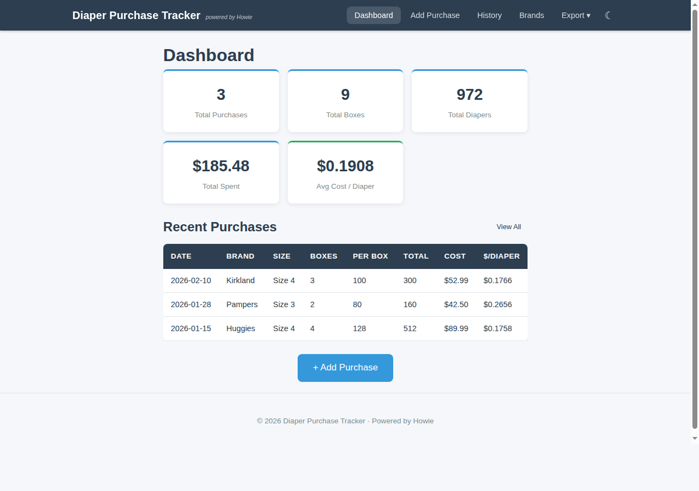
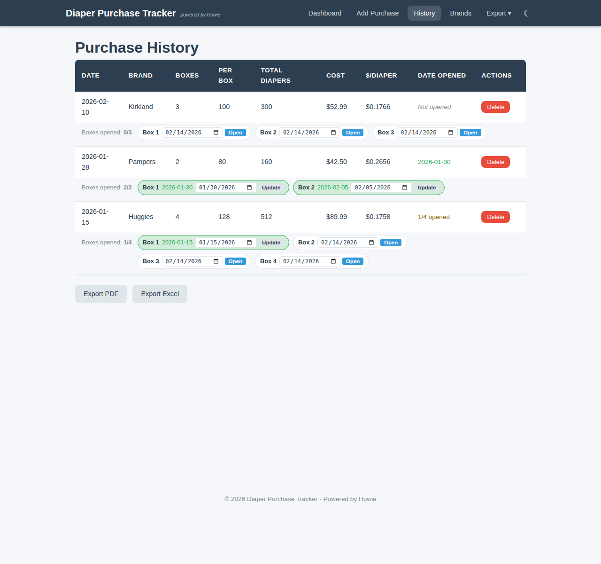

# Diaper Purchase Tracker

A web app for tracking diaper purchases, costs, and box opening dates. Built with Flask and SQLite.

**Live at:** https://diaper.lg-fast.com

## Screenshots





## Features

- **Purchase tracking** — Record date, brand, number of boxes, diapers per box, and cost
- **Per-box opening dates** — Track when each individual box is opened, with date picker controls
- **Dashboard** — Summary stats: total purchases, boxes, diapers, spending, and average cost per diaper
- **History** — Full purchase history with inline box opening management and delete
- **Brand management** — Save frequently used brands for quick selection
- **Exports** — PDF and Excel reports with all purchase and opening data
- **Dark mode** — Toggle between light and dark themes
- **Mobile responsive** — Works on desktop and mobile browsers

## Tech Stack

- **Backend:** Python, Flask, Gunicorn
- **Database:** SQLite
- **Frontend:** Jinja2 templates, vanilla CSS/JS
- **Server:** Nginx reverse proxy, systemd service
- **Exports:** ReportLab (PDF), openpyxl (Excel)

## Setup

```bash
# Clone and enter directory
git clone https://github.com/volfan37135/diaper-tracker.git
cd diaper-tracker

# Create virtual environment and install dependencies
python3 -m venv venv
source venv/bin/activate
pip install -r requirements.txt

# Run locally
python app.py
```

The app will be available at `http://localhost:5003`.

## Production Deployment

The included `diaper-tracker.service` and `diaper-tracker.nginx.conf` files configure systemd and Nginx for production use:

```bash
# Copy service file and enable
sudo cp diaper-tracker.service /etc/systemd/system/
sudo systemctl enable --now diaper-tracker

# Configure Nginx
sudo cp diaper-tracker.nginx.conf /etc/nginx/sites-available/diaper-tracker
sudo ln -s /etc/nginx/sites-available/diaper-tracker /etc/nginx/sites-enabled/
sudo nginx -t && sudo systemctl reload nginx
```

## Project Structure

```
├── app.py                 # Flask routes and export logic
├── models.py              # Database models and queries
├── forms.py               # WTForms form definitions
├── templates/             # Jinja2 HTML templates
│   ├── base.html
│   ├── index.html         # Dashboard
│   ├── add_purchase.html  # Add purchase form
│   ├── history.html       # Purchase history with box opening UI
│   └── manage_brands.html # Brand management
├── static/
│   ├── css/style.css      # All styles including dark mode
│   └── js/main.js         # Theme toggle and UI interactions
├── requirements.txt
└── database.db            # SQLite database (created on first run)
```
